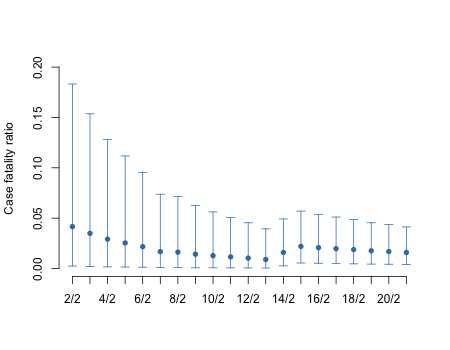

# Estimating case fatality ratio of 2019-nCoV from observed cases outside China

*Updated report: 7 February 2020*

Christian L. Althaus (christian.althaus@ispm.unibe.ch), Institute of Social and Preventive Medicine, University of Bern, Bern, Switzerland

**Summary: We provide a preliminary estimate of the case fatality ratio (CFR) of 2019-nCoV at 1.7% (95% confidence interval: 0.1%-7.5%). While there remains considerable uncertainty around this estimate (n = 1!), CFR is arguably higher than what is typically observed for seasonal influenza, but lower than what was observed for SARS-CoV or MERS-CoV.**

While the basic reproduction number of the 2019-nCoV epidemic in China [has been estimated](https://github.com/jriou/wcov) at 2.2 (90% high density interval: 1.4-3.8) (1,2), there remains considerable uncertainty regarding the case fatality ratio (CFR). To date, naive estimates of CFR from the reported numbers of confirmed cases and deaths are difficult to interpret due to possible biases in observed cases and the right-censoring of cases with respect to the time delay from illness onset to death (3).

We argue that reported 2019-nCoV cases and deaths outside China are less prone to bias and could provide more precise estimates of the absolute CFR (Figure 1). The first fatal case of 2019-nCoV outside China is a 44-year-old man from Wuhan, China, who died in a hospital in Manila, Philippines, on February 1, 2020.

**Figure 1. Reported 2019-nCoV cases outside China by onset of symptoms and time of death.** The WHO [Novel Coronavirus(2019-nCoV) Situation Report - 18](https://www.who.int/emergencies/diseases/novel-coronavirus-2019/situation-reports) reports onset of symptoms for 121 cases (out of a total of 216 cases). The first death outside China has been reported by WHO, [ECDC](https://www.ecdc.europa.eu/en/novel-coronavirus-china) and [international media](https://www.theguardian.com/global-development/2020/feb/02/coronavirus-deaths-hong-kong-health-workers-to-strike-china-border-).

First, we collect 2019-nCoV cases and deaths outside China from [WHO](https://www.who.int/emergencies/diseases/novel-coronavirus-2019/situation-reports/), [ECDC](https://www.ecdc.europa.eu/en/novel-coronavirus-china) and [international media](https://www.theguardian.com/global-development/2020/feb/02/coronavirus-deaths-hong-kong-health-workers-to-strike-china-border-) (Figure 1). We then model the expected incidence of death due 2019-nCoV given the CFR. To this end, we assume that the time from onset to death follows a gamma distribution with a mean of 15.3 days and a shape parameter of 5.05 (Figure 2) (4). Finally, we use a maximum-likelihood framework to estimate CFR by fitting the model to the data assuming the observed numbers of deaths are Poisson distributed (see `R` code file [`ncov_cfr.R`](ncov_cfr.R)).

**Figure 2. Probability distribution of time from onset of 2019-nCoV symptoms to death.** The distribution is based on the estimates by Linton et al. (3).

We estimate the CFR of 2019-nCoV at 1.7% (95% confidence interval: 0.1%-7.5%). Due to the observation of only one death outside China, the uncertainty around this estimate remains wide. We expect future estimates to become more precise with higher numbers of cases and deaths outside China (Figure 3). Furthermore, the estimate could represent an upper bound because information on date of onset is not available for all reported cases and asymptomatic cases are not included. It is also important to note that the fatal case in Manila was [co-infected with *Streptococcus pneumoniae* and *influenza B virus*](https://twitter.com/joel_mossong/status/1223989493176459266?s=20).

**Figure 3. Change in precision of estimates of 2019-nCoV case fatality ratio.** Future estimates including additional cases and deaths outside China are expected to become more precise.

## References

1. Riou, J. and Althaus, C. L. (2020). [Pattern of early human-to-human transmission of wuhan 2019 novel coronavirus (2019-ncov), December 2019 to January 2020.](https://doi.org/10.2807/1560-7917.ES.2020.25.4.2000058) Eurosurveillance, 25(4).
2. Li, Q., Guan, X., Wu, P., Wang, X., Zhou, L., Tong, Y., et al. (2020). [Early transmission dynamics in Wuhan, China, of novel coronavirus-infected pneumonia](https://doi.org/10.1056/NEJMoa2001316). N Engl J Med.
3. Jung, S., Akhmetzhanov, A. R., Hayashi, K., Linton, N. M., Yang, Y., Yuan, B., et al. (2020). [Real time estimation of the risk of death from novel coronavirus (2019-nCoV) infection: Inference using exported cases](http://dx.doi.org/10.1101/2020.01.29.20019547). medRxiv.
4. Linton, N. M., Kobayashi, T., Yang, Y., Hayashi, K., Akhmetzhanov, A. R., Jung, S., et al. (2020). [Epidemiological characteristics of novel coronavirus infection: A statistical analysis of publicly available case data](http://dx.doi.org/10.1101/2020.01.26.20018754). medRxiv.
