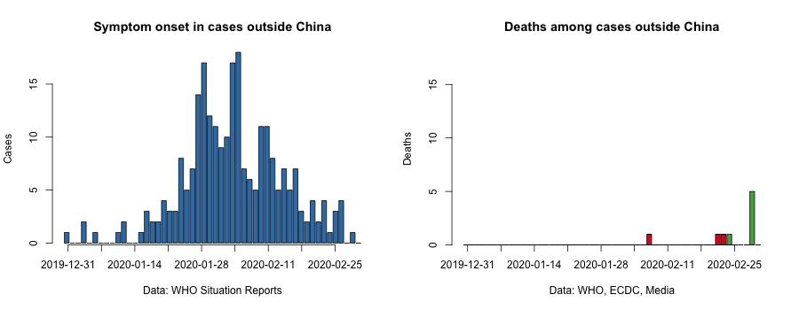
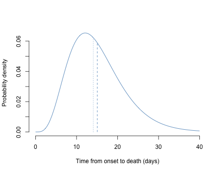

# Estimating case fatality ratio of COVID-19 from observed cases outside China

*Updated report: 18 February 2020*

Christian L. Althaus (christian.althaus@ispm.unibe.ch), Institute of Social and Preventive Medicine, University of Bern, Bern, Switzerland

**Summary: We provide a preliminary estimate of the overall case fatality ratio (CFR) of COVID-19 at 2.5% (95% confidence interval: 0.8%-5.8%).**

COVID-19 has spread rapidly in China with a basic reproduction number of 2.2 (90% high density interval: 1.4-3.8) and a doubling time of around one week during the early phase of the epidemic (1,2). To date, uncertainty remains regarding the case fatality ratio (CFR) of COVID-19. Naive estimates of CFR from the reported numbers of confirmed cases and deaths are difficult to interpret due to the possible underascertainment of mild cases and the right-censoring of cases with respect to the time delay from illness onset to death (3). We argue that reported COVID-19 cases and deaths outside China are less prone to bias and could provide more precise estimates of the absolute CFR (Figure 1, Table 1).

**Figure 1. Reported COVID-19 cases outside China by onset of symptoms and time of death.** The WHO [Coronavirus disease 2019 (COVID-19) situation reports](https://www.who.int/emergencies/diseases/novel-coronavirus-2019/situation-reports/) provide the dates of onset of symptoms of cases outside China. Deaths outside China have been reported by WHO, [ECDC](https://www.ecdc.europa.eu/en/novel-coronavirus-china) and international media.

**Table 1. List of fatal COVID-19 cases outside China.**

Date | Country | Sex | Age | Comorbidities | Notes | Source
--- | --- | --- | --- | --- | --- | ---
1 Feb 2020 | Philippines | Male | 44 y | *Streptococcus pneumoniae* and *influenza B virus* | Included | [Link](https://www.theguardian.com/global-development/2020/feb/02/coronavirus-deaths-hong-kong-health-workers-to-strike-china-border-)
13 Feb 2020 | France | Male | 80 y | - | Included | [Link](https://www.theguardian.com/world/2020/feb/15/chinese-tourist-in-france-becomes-europes-first-coronavirus-fatality)
14 Feb 2020 | Japan | Female | 80+ y | - | Included | [Link](https://www.theguardian.com/world/2020/feb/13/japan-reports-first-coronavirus-death-as-44-more-cases-confirmed-aboard-cruise-ship)
15 Feb 2020 | Taiwan | Male | 61 y | *Hepatitis B virus* and diabetes | Included | [Link](https://www.theguardian.com/world/2020/feb/16/taiwan-reports-first-death-from-coronavirus)

First, we collect COVID-19 cases and deaths outside China from [WHO](https://www.who.int/emergencies/diseases/novel-coronavirus-2019/situation-reports/), [ECDC](https://www.ecdc.europa.eu/en/novel-coronavirus-china) and international media (Figure 1, Table 1). We then model the expected incidence of death due to COVID-19 given the CFR. To this end, we assume that the time from onset to death follows a gamma distribution with a mean of 15.1 days and a shape parameter of 5.1 (Figure 2) (4). Finally, we use a maximum-likelihood framework to estimate CFR by fitting the model to the data assuming the observed numbers of deaths are Poisson distributed (see `R` code file [`ncov_cfr.R`](ncov_cfr.R)).

**Figure 2. Probability distribution of time from onset of COVID-19 symptoms to death.** The distribution is based on publicly available data collected by Linton et al. (4). Dashed and dotted lines corresond to the mean (15.1 days) and median (14.1 days).

We estimate the CFR of COVID-19 at 2.5% (95% confidence interval: 0.8%-5.8%). Due to the small number of deaths, the uncertainty around this estimate remains wide. Increasing numbers of cases and deaths outside China will increase the precision of the estimate (Figure 3). Furthermore, the estimate could represent an upper bound because information on date of onset of symptoms is not available for all reported cases and asymptomatic cases are not included.

**Figure 3. Change in precision of estimates of COVID-19 case fatality ratio.** Future estimates including additional cases and deaths outside China will become more precise.

## Acknowledgements
We would like to thank Hiroshi Nishiura for kindly sharing the data collected by Linton et al. (4).

## References

1. Riou, J. and Althaus, C. L. (2020). [Pattern of early human-to-human transmission of wuhan 2019 novel coronavirus (2019-ncov), December 2019 to January 2020.](https://doi.org/10.2807/1560-7917.ES.2020.25.4.2000058) Euro Surveill, 25(4).
2. Li, Q., Guan, X., Wu, P., Wang, X., Zhou, L., Tong, Y., et al. (2020). [Early transmission dynamics in Wuhan, China, of novel coronavirus-infected pneumonia](https://doi.org/10.1056/NEJMoa2001316). N Engl J Med.
3. Jung, S., Akhmetzhanov, A. R., Hayashi, K., Linton, N. M., Yang, Y., Yuan, B., et al. (2020). [Real time estimation of the risk of death from novel coronavirus (2019-nCoV) infection: Inference using exported cases](http://dx.doi.org/10.1101/2020.01.29.20019547). medRxiv.
4. Linton, N. M., Kobayashi, T., Yang, Y., Hayashi, K., Akhmetzhanov, A. R., Jung, S., et al. (2020). [Incubation period and other epidemiological characteristics of 2019 novel coronavirus infections with right truncation: a statistical analysis of publicly available case data](https://doi.org/10.3390/jcm9020538). J Clin Med, 9(2).
